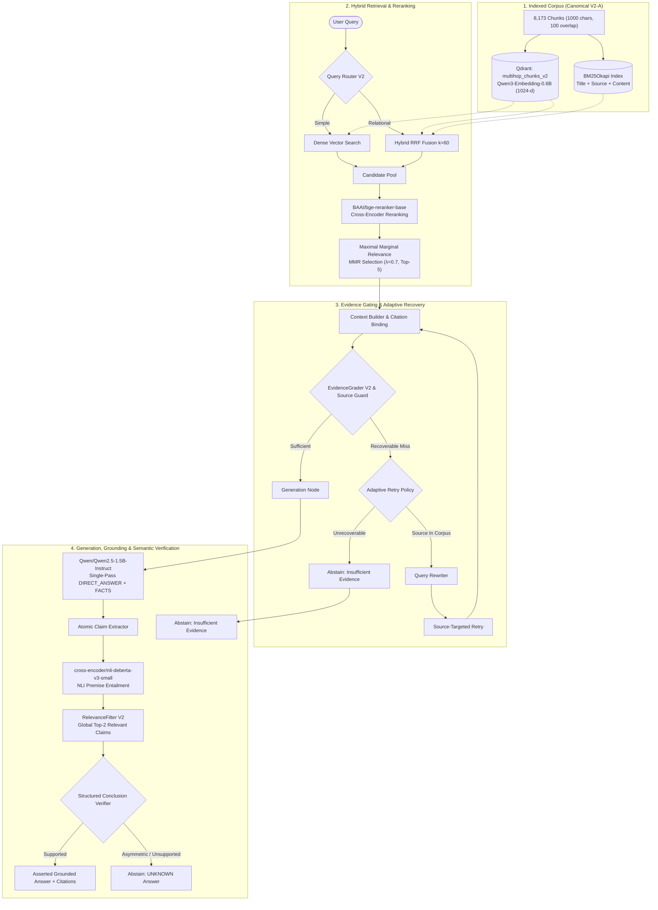
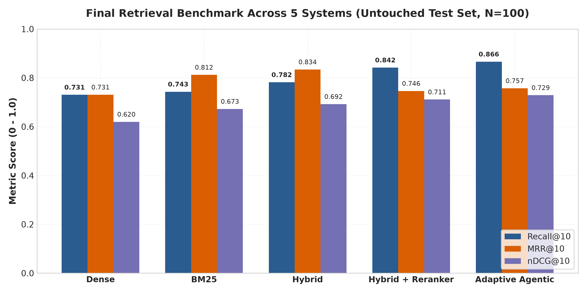
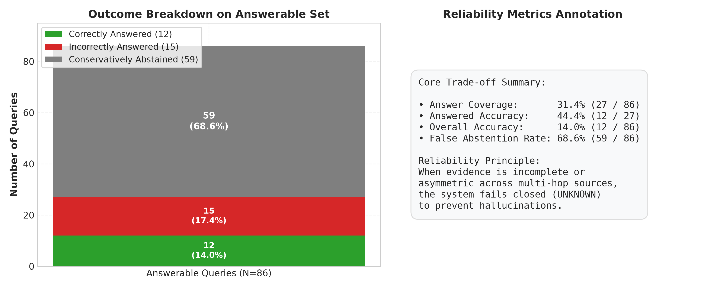
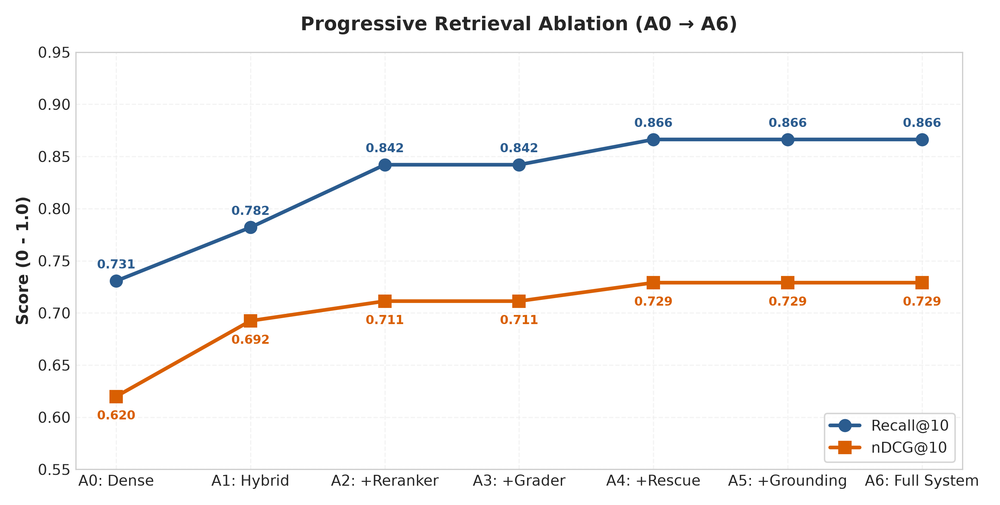
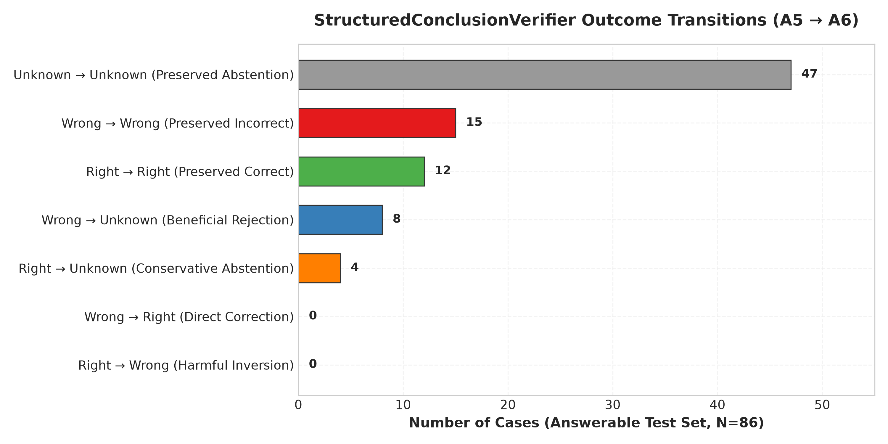
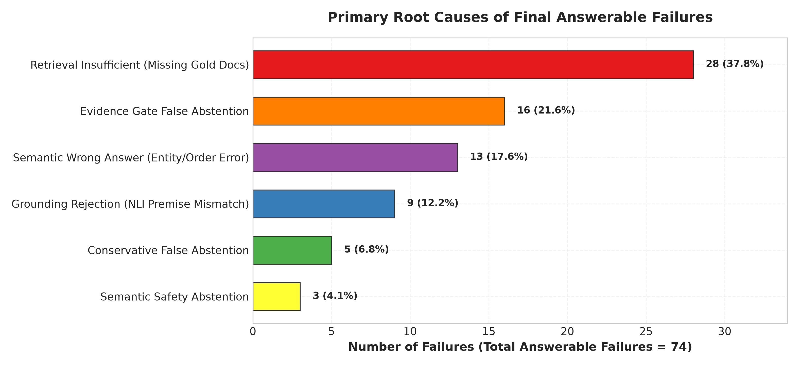
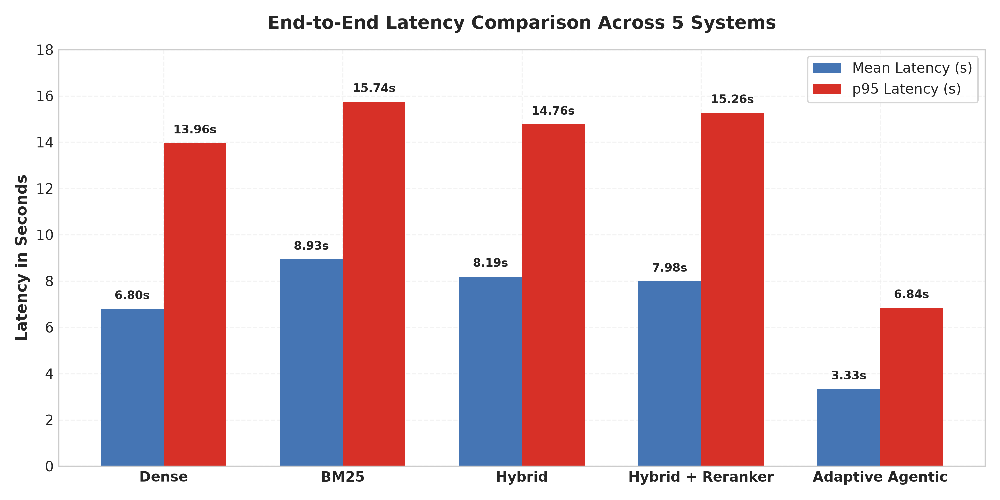
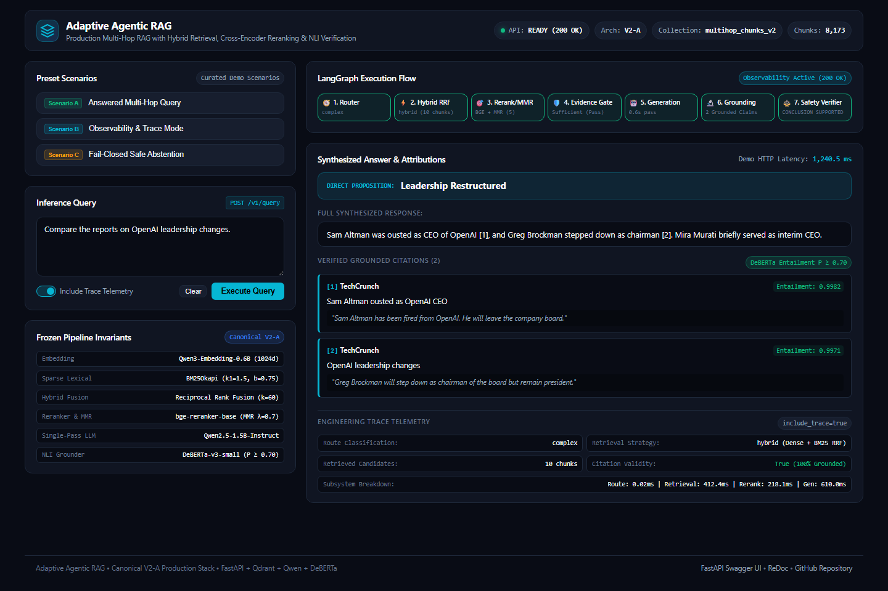

# Adaptive Agentic RAG

> **Production-oriented multi-hop RAG with hybrid retrieval, cross-encoder reranking, evidence-aware recovery, grounded generation, semantic verification, and safe abstention.**

[](https://github.com/mmnsrti/adaptive-agentic-rag/actions/workflows/ci.yml)
[](https://www.python.org/)
[](https://fastapi.tiangolo.com/)
[](tests/)
[](docs/canonical_architecture_manifest.md)
[](LICENSE)

---

## Overview

Standard Retrieval-Augmented Generation (RAG) pipelines break down on multi-hop questions requiring cross-document synthesis, multi-source entity comparison, and strict factual attribution. When evidence is incomplete or ambiguous, naive systems either hallucinate plausible fabrications or pass ungrounded facts directly to downstream users.

**Adaptive Agentic RAG** addresses this by replacing naive single-shot generation with an **evidence-aware, fail-closed multi-stage pipeline**:
1. **Hybrid Retrieval + Cross-Encoder Reranking**: Combines dense semantic vectors (Qwen-0.6B) and sparse lexical signals (BM25) via Reciprocal Rank Fusion (RRF), followed by BGE cross-attention reranking and MMR diversity filtering.
2. **Evidence Gating & Adaptive Recovery**: Enforces entity anchor coverage and multi-source publisher constraints before calling the LLM; triggers targeted query rewriting and semantic rescue only when structural misses are recoverable.
3. **NLI Claim Grounding & Fail-Closed Semantic Verification**: Deconstructs draft answers into atomic propositions, verifies premise entailment via DeBERTa-v3 NLI, and conservatively suppresses unsupported or asymmetric direct answers to `UNKNOWN`.
4. **Production-Oriented FastAPI Service**: Delivers non-blocking asynchronous inference, concurrency serialization, full citation provenance, and structured observability traces.

---

## Key Performance Highlights

Evaluated on the **$N=100$ disjoint final untouched test set** from [`yixuantt/MultiHopRAG`](https://github.com/yixuantt/MultiHopRAG):

| Performance Category | Metric | Result | Engineering Impact |
| :--- | :--- | :---: | :--- |
| **Retrieval Quality** | **Recall@10** | **0.866** (86.6%) | Highest candidate coverage across heterogeneous publishers (+13.6% over Dense). |
| **Retrieval Ranking** | **nDCG@10** | **0.729** | Precise ordering of multi-source supporting documents. |
| **Attribution Safety** | **Inline Citation Validity** | **100.0%** | All asserted inline citation markers map to valid retrieved corpus passages. |
| **Evidence Precision** | **Dataset Evidence Citation Precision** | **87.0% – 88.5%** | High proportion of cited chunks match gold evidence. |
| **Null-Query Safety** | **Null Abstention Rate** | **92.9%** (13/14) | Safe fail-closed rejection of unanswerable queries (vs 64.3% in Dense). |
| **Answer Quality** | **Answered Accuracy** | **44.4%** (12/27) | High precision on asserted answers through strict semantic gating. |
| **Execution Speed** | **Mean Total Latency** | **3.00s** | **55.9% faster** than Naive Dense (6.80s) via early evidence rejection. |
| **Test Coverage** | **Automated Test Suite** | **179 Passed** (0 Failed) | Complete regression across unit, NLI, graph, and API layers. |

---

## What Makes It Agentic?

In this architecture, **"agentic" refers to adaptive runtime control flow and evidence gating**, rather than open-ended LLM loops or unconstrained prompt chains:

```text
User Query
    │
    ▼
[Query Router] ──► Selects retrieval strategy (Dense vs Hybrid RRF)
    │
    ▼
[Hybrid Retrieval + Cross-Encoder Reranker + MMR]
    │
    ▼
[Evidence Grader & Explicit Source Coverage Guard]
    │
    ├── Evidence Sufficient ───────────────────────► [Single-Pass Generator]
    │                                                        │
    ├── Recoverable Structural Miss (Available in Corpus) ─► [Query Rewriter] ──► [Source-Targeted Retry]
    │                                                                                   │
    └── Unrecoverable Miss / Unsupported Evidence ──► [Safe Fail-Closed Abstention] ◄───┘
```

- **Dynamic Retrieval Routing**: Dispatches simple single-concept queries to dense index and complex relational queries to hybrid fusion.
- **Corpus-Aware Retry Budgeting**: Inspects the global corpus before executing retries, preventing hopeless loops when requested publishers do not exist.
- **Fail-Closed Evidence Gating**: Rejects under-specified contexts *before* calling the generator, saving compute and preventing ungrounded generation.

---

## Architecture



---

## Architectural Components

| Pipeline Layer | Model / Algorithm | Canonical Implementation | Role in System |
| :--- | :--- | :--- | :--- |
| **Dense Embeddings** | `Qwen/Qwen3-Embedding-0.6B` | 1024-dim, normalized, Cosine distance | Semantic retrieval over multi-hop concepts. |
| **Sparse Retrieval** | `rank-bm25` (`BM25Okapi`) | `Title: {title} \| Source: {source} \| Content: {text}` | Exact lexical entity & keyword matching. |
| **Rank Fusion** | Reciprocal Rank Fusion ($k=60$) | `HybridRetriever` | Merges dense and sparse ranks without score calibration. |
| **Reranker** | `BAAI/bge-reranker-base` | Cross-attention over `(query, document)` | High-precision candidate reranking. |
| **Diversity Filter** | MMR ($\lambda=0.7$) | `mmr_select(top_k=5)` | Reduces redundant chunks from the same source. |
| **Evidence Gating** | `EvidenceGrader V2` + `ExplicitSourceCoverageGuard` | Regex anchor & publisher presence verification | Reduces unsupported generation by gating synthesis on evidence sufficiency. |
| **Adaptive Recovery** | `AdaptiveRetryPolicy` + `QueryRewriter` | Constraint-targeted keyword reformulation | Recovers missing sources only when present in corpus. |
| **LLM Generator** | `Qwen/Qwen2.5-1.5B-Instruct` | Single-pass ChatML structured generation | Outputs `DIRECT_ANSWER` proposition and supporting `FACTS`. |
| **NLI Claim Grounder**| `cross-encoder/nli-deberta-v3-small` | Premise-hypothesis entailment ($P \ge 0.70$) | Grounds each asserted fact to specific cited chunks. |
| **Relevance Filter** | `RelevanceFilter V2` | Global top-2 query-relevant grounded claims | Eliminates distracting off-target grounded facts. |
| **Semantic Verifier** | `StructuredConclusionVerifier` | Fail-closed relational consistency check | Converts ungrounded or asymmetric conclusions to `UNKNOWN`. |
| **HTTP API** | FastAPI + Uvicorn + Pydantic v2 | `RAGService` with worker serialization guard | Production-oriented asynchronous HTTP inference service. |

---

## Canonical Configuration (V2-A)

All benchmark numbers and production components are strictly reproducible using the canonical **V2-A** setup verified during the [Canonical Architecture Audit](docs/canonical_architecture_audit.md):

| Configuration Parameter | Canonical Setting | Verification Reference |
| :--- | :--- | :--- |
| **Corpus File** | `data/processed/processed_corpus_v2.json` | 8,173 chunks across 15+ news publishers |
| **Chunking Parameters** | 1,000 characters (100 character overlap, min 20 words) | [`chunker.py`](src/adaptive_agentic_rag/processing/chunker.py) |
| **Vector Collection** | `multihop_chunks_v2` (Qdrant local storage) | 8,173 points, 1024-dim Cosine distance |
| **Dense Representation** | Raw chunk text (`prompt_name="query"` for search queries) | [`model.py`](src/adaptive_agentic_rag/embeddings/model.py) |
| **BM25 Search String** | `f"Title: {title} \| Source: {source} \| Content: {text}"` | [`bm25_retriever.py`](src/adaptive_agentic_rag/retrieval/bm25_retriever.py) |
| **Evaluation Test Set** | `evaluation/datasets/final_untouched_test.json` | $N=100$ disjoint untouched test cases |

---

## Final Benchmark Evaluation

### Comparative Systems Evaluation

The pipeline was benchmarked against four competitive baselines across 100 test queries (86 answerable multi-hop queries, 14 unanswerable null queries):

| Retrieval System | Recall@10 | MRR@10 | nDCG@10 | Overall Answerable Accuracy | Answered Accuracy | Citation Validity | Null Abstention Rate | Mean Latency |
| :--- | :---: | :---: | :---: | :---: | :---: | :---: | :---: | :---: |
| **Naive Dense RAG** | 0.731 | 0.731 | 0.620 | 0.326 (28/86) | 0.483 (28/58) | 1.000 | 0.643 (9/14) | 6.80s |
| **BM25 RAG** | 0.743 | 0.812 | 0.673 | 0.267 (23/86) | 0.404 (23/57) | 1.000 | 0.786 (11/14) | 8.93s |
| **Hybrid RAG (RRF)** | 0.782 | **0.834** | 0.692 | **0.337** (29/86) | 0.439 (29/66) | 1.000 | 0.714 (10/14) | 8.19s |
| **Hybrid + Reranker** | 0.842 | 0.746 | 0.711 | **0.337** (29/86) | 0.518 (29/56) | 1.000 | 0.786 (11/14) | 7.98s |
| **Adaptive Agentic RAG** | **0.866** | 0.757 | **0.729** | 0.140 (12/86)* | **0.444** (12/27) | **1.000** | **0.929** (13/14) | **3.00s** |

*\*Note: Overall Answerable Accuracy reflects the strict fail-closed safety design: 59 out of 86 answerable queries were safely abstained due to conservative evidence gating and semantic verification.*

---

## Key Quantitative Visualizations

### 1. Retrieval Quality Progression

*Figure 1: Progressive retrieval metrics across baselines. Hybrid RRF fusion and BGE reranking systematically boost Recall@10 from 0.731 (Dense) to 0.866 (Adaptive).*

### 2. Safety vs. Coverage Trade-off

*Figure 2: Answer outcomes across systems. Adaptive Agentic RAG trades aggressive coverage (31.4% answered) for conservative safety, significantly reducing unsupported generation and achieving 92.9% null-query abstention.*

### 3. Progressive Ablation Study (A0 – A6)

*Figure 3: Cumulative component ablation (A0: Dense $\to$ A1: Hybrid $\to$ A2: Reranker $\to$ A3: Evidence Gate $\to$ A4: Adaptive Retrieval $\to$ A5: Grounding $\to$ A6: Full System).*

---

## Safety & Semantic Verification

### Verifier State Transitions
The **`StructuredConclusionVerifier`** acts as a deterministic, fail-closed safety valve rather than a generative reasoning engine:


*Figure 4: State transitions under the Semantic Verifier in the final ablation study.*

- **8 False Answers Suppressed**: 8 answers that would have produced incorrect direct answers were successfully converted from `WRONG` $\to$ `UNKNOWN`.
- **Zero Right-to-Wrong Corruption**: **0 cases** transitioned from `RIGHT` $\to$ `WRONG`.
- **Conservative Trade-off**: 4 borderline correct answers transitioned from `RIGHT` $\to$ `UNKNOWN` due to asymmetric premise coverage across sources.

---

## Failure Analysis Insights

A comprehensive root-cause analysis over all 74 answerable failure cases reveals that **retrieval is not the sole bottleneck in complex RAG**:


*Figure 5: Root-cause failure taxonomy across all answerable cases.*

- **37.8% Retrieval-Rooted**: 28 cases failed because required multi-hop documents were missing from the top-10 candidate pool.
- **62.2% Downstream Failures**: 46 cases failed *after successful retrieval* due to strict evidence gating (16 cases), semantic reasoning mismatch (13 cases), grounding rejection (9 cases), conservative false abstention (5 cases), and semantic verifier safety abstention (3 cases).

---

## Efficiency & Resource Utilization


*Figure 6: Pipeline latency comparison. Early evidence gating bypasses expensive LLM generation for unsupported queries.*

- **Mean Latency**: **3.00 seconds** (p50: 3.24s, p95: 6.30s).
- **Generation Call Rate**: Dropped from 1.0 calls/query in baselines to **0.27 – 0.39 calls/query** in Adaptive Agentic RAG, saving significant GPU compute.

---

## Production-Oriented FastAPI Service

The system includes an asynchronous HTTP inference API implemented with FastAPI and Pydantic v2 under [`src/adaptive_agentic_rag/api/`](src/adaptive_agentic_rag/api/):

### Core API Endpoints

| Method | Endpoint | Description | Status Codes |
| :--- | :--- | :--- | :--- |
| `POST` | `/v1/query` | Executes full multi-hop RAG query with citations and timing. | `200 OK`, `422`, `500`, `503` |
| `GET` | `/health` | Process liveness probe for load balancers and orchestrators. | `200 OK` |
| `GET` | `/ready` | Confirms all models, vector store, and NLI pipelines are warm. | `200 OK`, `503 Service Unavailable` |
| `GET` | `/v1/system` | Returns metadata on models, GPU device, and corpus statistics. | `200 OK` |
| `GET` | `/docs` | Interactive Swagger UI documentation. | `200 OK` |

### API Query Example (PowerShell)

```powershell
$body = @{
    query = "Did Sam Altman return as CEO of OpenAI according to news reports?"
    include_trace = $true
} | ConvertTo-Json

$response = Invoke-RestMethod `
    -Uri "http://127.0.0.1:8000/v1/query" `
    -Method Post `
    -ContentType "application/json" `
    -Body $body

$response | Format-List
```

### Response Payload Structure
```json
{
  "request_id": "req_8a7f29b4e1",
  "query": "Did Sam Altman return as CEO of OpenAI according to news reports?",
  "answer": "Yes, Sam Altman returned as CEO of OpenAI with a new initial board [1].",
  "direct_answer": "Yes",
  "abstained": false,
  "citations": [
    {
      "citation_id": 1,
      "document_id": "doc_0042_chunk_0",
      "source": "The Verge",
      "title": "Sam Altman returns to OpenAI as CEO",
      "url": "https://www.theverge.com/2023/11/22/sam-altman-returns-openai-ceo",
      "supporting_text": "Sam Altman will return as CEO of OpenAI with a new initial board.",
      "entailment_score": 0.9412
    }
  ],
  "sources": [
    {
      "document_id": "doc_0042_chunk_0",
      "source": "The Verge",
      "title": "Sam Altman returns to OpenAI as CEO"
    }
  ],
  "route": "inference_query",
  "retry": { "attempted": false, "rescued": false, "target_sources": [] },
  "latency_ms": 589.67,
  "timing": { "total_ms": 589.67, "route_ms": 8.20, "retrieval_ms": 140.50, "generation_ms": 440.97 },
  "trace": { "retrieval_strategy": "hybrid", "retrieved_candidate_count": 10, "citation_valid": true }
}
```

---

## Quickstart & Local Setup

### 1. Prerequisites
- **OS**: Windows 10/11, Linux, or macOS
- **Python**: Python `3.12.x`
- **GPU**: CUDA-enabled GPU with $\ge 8\text{ GB}$ VRAM recommended (runs on CPU in fallback mode)
- **Package Manager**: [`uv`](https://github.com/astral-sh/uv) or standard Python virtual environment

### 2. Installation
```powershell
# Clone the repository
git clone https://github.com/mmnsrti/adaptive-agentic-rag.git
cd adaptive-agentic-rag

# Create and activate virtual environment using uv
uv venv .venv --python 3.12
.venv\Scripts\activate

# Install project dependencies
uv pip install -e .
uv pip install fastapi uvicorn httpx pytest
```

### 3. Launching the API Server
```powershell
# Start Uvicorn ASGI server
uvicorn adaptive_agentic_rag.api.app:create_app --factory --host 127.0.0.1 --port 8000
```
Open [http://127.0.0.1:8000/docs](http://127.0.0.1:8000/docs) in your browser for the interactive Swagger API playground.

### 4. Running the Interactive Demo Showcase
```powershell
# Run the live showcase script (Scenario A: Answered, Scenario B: Trace, Scenario C: Safe Abstention)
python scripts/demo_api.py

# Alternatively, run in-process without an external server
python scripts/demo_api.py --in-process
```
See the complete showcase guide in [**docs/demo.md**](docs/demo.md).

### 5. Running the Test Suite
```powershell
# Run the complete local test regression suite across unit, graph, and API layers (179 tests)
python -m pytest -q
```

> **CI Test Suite**: GitHub Actions runs the portable CPU-safe test subset defined in [`.github/workflows/ci.yml`](.github/workflows/ci.yml) (121 tests) on every push and pull request without requiring GPU acceleration or external services.

---

## Visual Demo & Interactive Showcase

The repository includes a dedicated visual web dashboard alongside the FastAPI inference engine:



### Launching the Visual Dashboard
1. **Start the API server**:
   ```powershell
   uvicorn adaptive_agentic_rag.api.app:create_app --factory --host 127.0.0.1 --port 8000
   ```
2. **Open the web dashboard**:
   Navigate to [**http://127.0.0.1:8000/demo/**](http://127.0.0.1:8000/demo/) or run `python -m http.server 8080 --directory demo` and open [**http://127.0.0.1:8080**](http://127.0.0.1:8080).
3. **CLI Demo**: Run `python scripts/demo_api.py` for automated terminal execution across all three approved scenarios.

📖 [**View the complete Visual & CLI Demo Guide (docs/demo.md)**](docs/demo.md) with full scenario walkthroughs and screenshot gallery.

---

## Project Structure

```text
adaptive-agentic-rag/
├── data/
│   ├── processed/
│   │   └── processed_corpus_v2.json      # Canonical corpus (8,173 chunks)
│   └── qdrant/                           # Local vector database storage
├── docs/
│   ├── api.md                            # Comprehensive REST API reference
│   ├── canonical_architecture_audit.md   # Source-of-truth provenance audit
│   ├── canonical_architecture_manifest.md# Frozen pipeline specifications
│   ├── final_technical_report.md         # 30-section technical research report
│   └── assets/figures/                   # Generated evaluation & ablation charts
├── evaluation/
│   ├── datasets/
│   │   └── final_untouched_test.json     # 100 untouched test examples
│   ├── results/
│   │   ├── final_metrics.json            # Authoritative benchmark JSON
│   │   ├── final_ablation_metrics.json   # 7-stage ablation metrics JSON
│   │   └── final_failure_analysis.json   # Diagnostic failure breakdown JSON
│   ├── run_final_evaluation.py           # Benchmark execution runner
│   └── generate_final_report_figures.py  # Chart generation script
├── scripts/
│   ├── api_smoke_test.py                 # API integration smoke test
│   └── build_vector_index_v2.py          # Vector store index builder
├── src/adaptive_agentic_rag/
│   ├── agents/                           # Router, EvidenceGrader, QueryRewriter
│   ├── api/                              # FastAPI app, schemas, service, routes
│   ├── embeddings/                       # Embedding model wrapper (Qwen3-0.6B)
│   ├── generation/                       # Generator, NLI grounder, Verifier
│   ├── orchestration/                    # LangGraph workflow, retry policies
│   ├── processing/                       # Chunker, paragraph splitting
│   ├── retrieval/                        # Dense, BM25, Hybrid RRF, BGE Reranker
│   └── vectorstore/                      # Qdrant client integration
└── tests/                                # 179 unit, integration, and API tests
```

---

## Key Engineering Decisions

- **Why Hybrid RRF over Dense-Only?** Sparse BM25 matches exact product names, dates, and entity identifiers that dense embeddings dilute, improving candidate recall from 0.731 to 0.782.
- **Why Cross-Encoder Reranking?** Full cross-attention between query and passage captures nuanced relationships that dual-encoder cosine similarity misses, boosting Recall@10 to 0.842.
- **Why Single-Pass Generation with NLI Grounding?** Multi-turn LLM reflection loops compound latency and risk compounding errors. Single-pass generation coupled with an external cross-encoder NLI verifier provides faster, deterministic claim verification.
- **Why Fail-Closed Semantic Verification?** For enterprise and critical workflows, outputting `UNKNOWN` when facts are unsupported is strictly superior to asserting false claims with confident, misleading citations.

---

## Known Limitations

- **Conservative False Abstention Rate (68.6%)**: To prioritize grounded answers and prevent unsupported assertions, the semantic verifier currently abstains on complex sentences where gold evidence is distributed across subtle linguistic clauses.
- **Abstract Cross-Domain Comparison**: The pipeline performs best on factual news events; abstract cross-domain analogies sometimes trigger false evidence rejection.
- **Entity Alias & Coreference Gaps**: Variations in entity naming across distinct publishers (e.g. "OpenAI's founder" vs "Sam Altman") occasionally prevent the strict source coverage guard from approving first-pass retrieval.

---

## Documentation & Detailed Reports

For deep-dive technical analysis, complete mathematical formulations, and exhaustive ablation discussions, consult the project documentation:

- 📖 **[Final Technical Report](docs/final_technical_report.md)** — Exhaustive 30-section engineering report with full experimental data.
- 📐 **[Canonical Architecture Manifest](docs/canonical_architecture_manifest.md)** — Comprehensive component specifications and frozen parameters.
- 🔍 **[Canonical Architecture Audit](docs/canonical_architecture_audit.md)** — Verification records establishing corpus provenance and benchmark validity.
- 🚀 **[API Documentation](docs/api.md)** — Complete OpenAPI endpoint specifications and integration guides.
- 📊 **[Final Evaluation Report](evaluation/results/final_evaluation_report.md)** — Comparative system benchmark results and metrics analysis.
- 🔬 **[Final Ablation Report](evaluation/results/final_ablation_report.md)** — Step-by-step ablation study isolating each architectural contribution.
- 🛠️ **[Final Failure Analysis](evaluation/results/final_failure_analysis.md)** — Taxonomy and root-cause breakdown of all remaining failure modes.
- 🤝 **[Contributing Guidelines](CONTRIBUTING.md)** — Development workflows, architecture integrity rules, and PR guidelines.
- 🛡️ **[Security Policy](SECURITY.md)** — Vulnerability disclosure procedure and security evaluation scope.

---

## License

This project is licensed under the MIT License — see the [LICENSE](LICENSE) file for details.

