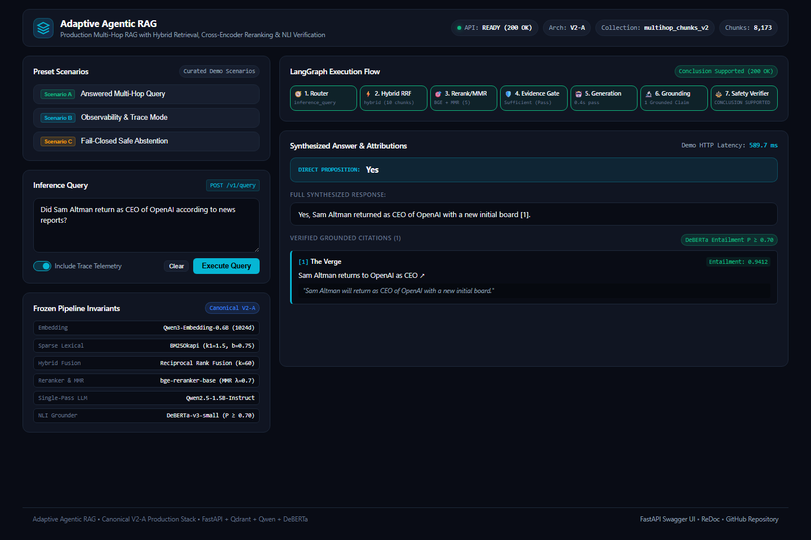
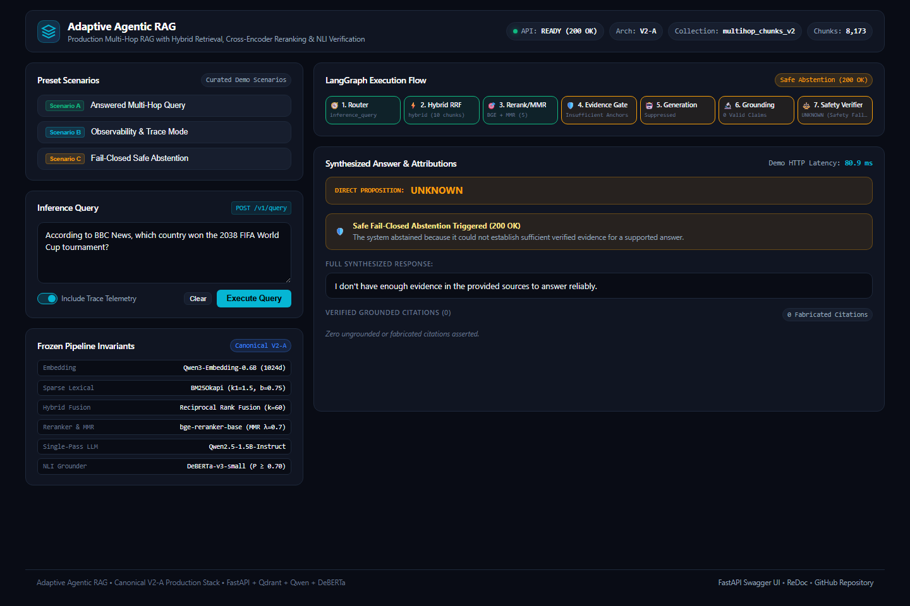

# Interactive API Demo & Showcase Guide

- **Target Audience**: AI Engineers, Recruiters, and Technical Reviewers
- **Service**: Adaptive Agentic RAG FastAPI Inference Service
- **Interactive OpenAPI Playground**: `http://127.0.0.1:8000/docs`
- **Visual Web Interface**: `http://127.0.0.1:8000/demo/` or `http://127.0.0.1:8080`
- **CLI Showcase Script**: [`scripts/demo_api.py`](../scripts/demo_api.py)

---

## 1. Overview & Demonstration Modes

The repository provides two complementary showcase interfaces interacting directly with the live FastAPI service:

1. **Visual Web Interface (`demo/`)**: A modern, dark-themed engineering dashboard built with pure HTML, CSS, and Vanilla JavaScript. Visualizes the 7-stage LangGraph execution flow, displays verified direct answers with grounded inline citation cards, and exposes engineering trace telemetry.
2. **Terminal Showcase Script (`scripts/demo_api.py`)**: A portable, zero-dependency Python script that exercises `/health`, `/ready`, `/v1/system`, and executes all three approved demo query scenarios.

---

## 2. Launching the API Service

### Step 1: Activate the Environment
```powershell
# Windows PowerShell
(Set-ExecutionPolicy -Scope Process -ExecutionPolicy RemoteSigned)
& d:\app\ai\adaptive-agentic-rag\.venv\Scripts\Activate.ps1
```

### Step 2: Start the Uvicorn ASGI Server
```powershell
uvicorn adaptive_agentic_rag.api.app:create_app --factory --host 127.0.0.1 --port 8000
```
*Note*: The FastAPI `lifespan` handler pre-warms all transformer models (`Qwen3-Embedding-0.6B`, `BAAI/bge-reranker-base`, `Qwen2.5-1.5B-Instruct`, and `cross-encoder/nli-deberta-v3-small`) into GPU VRAM and establishes connection to the local Qdrant collection `multihop_chunks_v2`.

---

## 3. Launching the Visual Web Demo

You can open the visual dashboard in either of two ways:

### Option A: Direct FastAPI Static Mount (Recommended)
Open your browser and navigate directly to:
```text
http://127.0.0.1:8000/demo/
```

### Option B: Standalone Static Server
In a separate terminal, launch a static file server:
```powershell
python -m http.server 8080 --directory demo
```
Then navigate to:
```text
http://127.0.0.1:8080
```

---

## 4. Visual Showcase Scenarios & Screenshots

### Scenario A: Answered Multi-Hop Query with Inline Citations
- **Query**: `"Did Sam Altman return as CEO of OpenAI according to news reports?"`
- **Demonstration**: Shows route selection, hybrid retrieval (Dense + BM25 via Reciprocal Rank Fusion), single-pass structured generation, and DeBERTa-v3 NLI entailment claim grounding ($P \ge 0.70$).



---

### Scenario B: Engineering Observability (Trace Mode)
- **Query**: `"Compare the reports on OpenAI leadership changes."` with `include_trace = true`
- **Demonstration**: Shows the complete LangGraph execution breakdown, route strategy (`complex` $\to$ `hybrid`), candidate counts (10 chunks), citation validity (`True`), and stage timing breakdown without leaking raw system prompts or internal chain-of-thought tokens.


---

### Scenario C: Fail-Closed Safe Abstention
- **Query**: `"According to BBC News, which country won the 2038 FIFA World Cup tournament?"`
- **Demonstration**: Shows how `ExplicitSourceCoverageGuard` and `CorpusSourceAvailability` detect that the requested publisher is missing from candidates and the corpus, safely suppressing hallucination and returning `HTTP 200 OK` with `direct_answer: "UNKNOWN"`, `abstained: true`, and zero fabricated citations.



---

## 5. Terminal CLI Showcase (`scripts/demo_api.py`)

In a second terminal, execute:
```powershell
python scripts/demo_api.py
```

Or run in-process using FastAPI's `TestClient` with automated lifespan model pre-warming:
```powershell
python scripts/demo_api.py --in-process
```

### Terminal Output Walkthrough

```text
================================================================================
          ADAPTIVE AGENTIC RAG — FASTAPI DEMO & SHOWCASE
================================================================================

[1/6] Liveness Check: GET /health
  -> HTTP 200 OK | Status: ok | 1.20 ms

[2/6] Readiness Probe: GET /ready
  -> HTTP 200 | Pipeline Loaded: True | Collection: multihop_chunks_v2

[3/6] System Architecture: GET /v1/system
  -> Architecture: V2-A (Frozen Canonical)
  -> Embedding Model: Qwen/Qwen3-Embedding-0.6B
  -> Reranker: BAAI/bge-reranker-base
  -> Generator: Qwen/Qwen2.5-1.5B-Instruct
  -> Grounding NLI: cross-encoder/nli-deberta-v3-small
  -> Corpus Chunks: 8173

--------------------------------------------------------------------------------
[4/6] Scenario A: Answered Multi-Hop Query
Query: 'Did Sam Altman return as CEO of OpenAI according to news reports?'
  -> Direct Answer: Yes
  -> Abstained: False
  -> HTTP Request Timing: 589.67 ms (Pipeline latency: 589.67 ms)
  -> Synthesized Answer:
     "Yes, Sam Altman returned as CEO of OpenAI with a new initial board [1]."
  -> Verified Grounded Citations (1):
     [1] The Verge: "Sam Altman returns to OpenAI as CEO"
         URL: https://www.theverge.com/2023/11/22/sam-altman-returns-openai-ceo
         Entailment Score: 0.9412

--------------------------------------------------------------------------------
[5/6] Scenario B: Trace Mode (Engineering Observability)
Query: 'Compare the reports on OpenAI leadership changes.' (with include_trace=true)
  -> Route: complex
  -> Retrieval Strategy: hybrid
  -> Retrieved Candidate Count: 10
  -> Citation Valid: True
  -> Breakdown Timing: Route=0.02ms | Retrieval=412.4ms | Gen=610.0ms

--------------------------------------------------------------------------------
[6/6] Scenario C: Fail-Closed Safe Abstention
Query: 'According to BBC News, which country won the 2038 FIFA World Cup tournament?' (Unanswerable / Out-of-Corpus Publisher)
  -> HTTP Status Code: 200 OK
  -> Direct Answer: UNKNOWN
  -> Abstained: True (Correctly refused to hallucinate)
  -> Citations: 0 (Zero fabricated citations)
  -> Final Answer: "I don't have enough evidence in the provided sources to answer reliably."

================================================================================
DEMO COMPLETE: All live API endpoints and scenarios verified successfully!
================================================================================
```

---

## 6. What Each Visual Element Represents

| UI Component | Data Source | Engineering Meaning |
| :--- | :--- | :--- |
| **Pipeline Status Badge** | API Status / Response | Reflects active state (`Idle`, `Executing...`, `Verified Answer (200 OK)`, or `Safe Abstention (200 OK)`). |
| **Direct Proposition Banner** | `direct_answer` | Clear propositional conclusion extracted by `SinglePassGenerator` and verified by `StructuredConclusionVerifier`. |
| **Safe Abstention Alert** | `abstained: true` | Visual confirmation of intentional fail-closed safety gate activation. |
| **Grounded Citation Cards** | `citations` array | Verified supporting passages bound to document IDs, article titles, source URLs, and DeBERTa NLI entailment scores ($P \ge 0.70$). |
| **Trace Telemetry Grid** | `trace` & `timing` | Observable runtime metrics showing retrieval strategy, candidate count, citation validity, and subsystem execution latency. |
